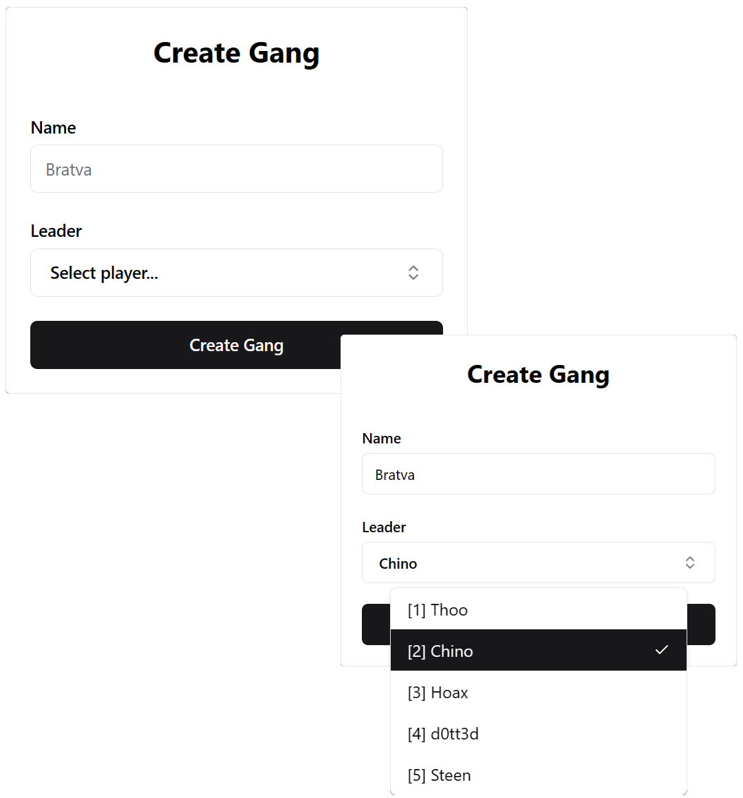

<div align="center">
  <h1>React FiveM Starter Template</h1>
  <p>A starter template for creating FiveM scripts with React, Vite, Tailwind CSS, and ShadeCN</p>
  
</div>

## Features

- ✨ Modern and fast development using [Vite](https://vitejs.dev/)
- ⚡ Full browser support with NUI mock data.
- 🚀 UI development with [React](https://reactjs.org/) and [Tailwind CSS](https://tailwindcss.com/)
- 🎨 Modern and customizable UI library [ShadCN](https://ui.shadcn.com/)
- ⚙️ Easily create beatiful and fast UI's for yor FiveM projects
- 🔧 Pre-configured build tools and settings

## Getting Started

Follow these steps to set up and start using the 'react-fivem' template:

We Recommend using [pnpm](https://pnpm.io/installation#on-windows), but you can use the package manager you prefer.

NOTE: Make sure you're running everything in the `web/` directory.

1. **Clone the repository:**

   ```bash
   git clone https://github.com/Cfx-Store/react-nui.git
   cd react-fivem/web
   ```

2. **Running the project**

   ```bash
   pnpm dev # For running the UI in the browser
   pnpm start # For running the UI for ingame
   ```

3. **Building the project**

   ```bash
   pnpm i
   pnpm build
   ```

4. **Adding ShadCN components**

   List of all components: https://ui.shadcn.com/docs/components/accordion

   ```bash
   pnpm ui:add <component>
   ```

   ```ts
   import { <Component> } from "@/components/ui/<component>";
   ```

Sure, I'll provide some enhancements to your documentation.

#### Visibility

```tsx
import { useVisibility } from "@/context/visibility-context";

export function Component() {
  const { setVisibility } = useVisibility();

  return (
    <>
      <button onClick={() => setVisibility(true)}>Show Component</button>
      <button onClick={() => setVisibility(false)}>Hide Component</button>
    </>
  );
}
```

Explanation:

- `useVisibility` is a hook from the `visibility-context` that manages component visibility.
- `setVisibility` allows toggling the visibility of the component.

#### Fetching

##### Lua:

```lua
RegisterNUICallback("getPlayerById", function(data, cb)
  local playerId = data["playerId"]
  local player = ... -- Retrieve player data

  cb(player)
end)
```

##### TypeScript:

```ts
// Provide mock data for testing in the browser environment
const mockedPlayer = ...

async function getPlayerById(id: number) {
  const result = await fetchNui<Player>("getPlayerById", { id }, mockedPlayer);
  return result;
}
```

Explanation:

- `RegisterNUICallback` in Lua registers a callback for fetching player data based on the ID passed.
- `getPlayerById` in TypeScript sends an asynchronous request using `fetchNui` to retrieve player data by ID.

#### Events

##### Lua:

```lua
RegisterNetEvent("cfx:updateCoins", function(coins)
  SendNuiAction("updateCoins", coins)
end)
```

##### TypeScript/React:

```tsx
export function Component() {
  const [coins, setCoins] = useState<number>(0);

  // In a real script, initially fetch coins

  useNuiEvent<number>("updateCoins", setCoins);

  return <span>Coins: {coins}</span>;
}
```

Explanation:

- `RegisterNetEvent` in Lua registers an event that updates the UI with the latest coin count.
- `useNuiEvent` in TypeScript/React hooks into the NUI event `updateCoins` and updates the UI with the latest coin count using `setCoins`.
